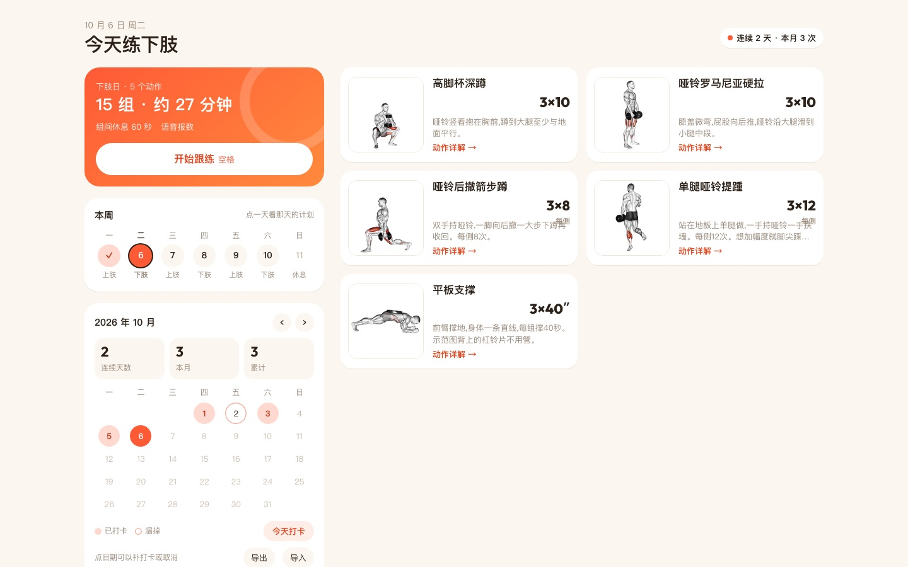
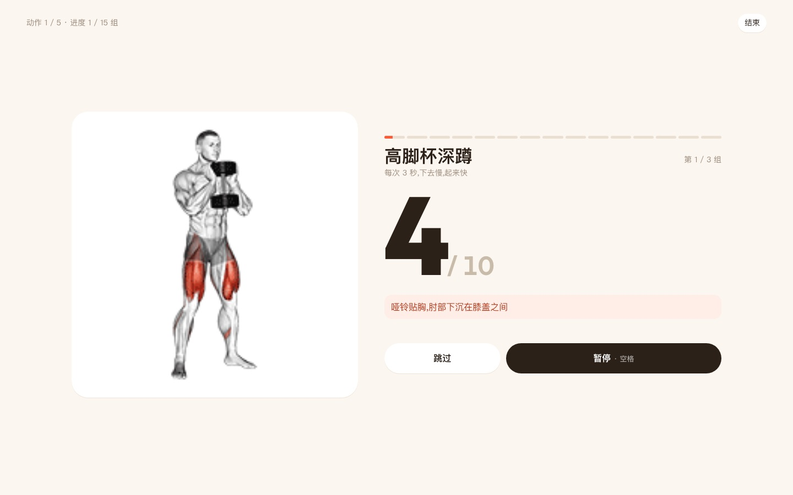

# home-workout

[中文说明](README.zh-CN.md)

A 20-minute daily dumbbell routine I follow at home. Upper and lower body alternate through the week, Sunday is rest. The page shows the day's exercises, counts reps out loud during a session, times the rest between sets, and keeps a check-in calendar.

Live: https://yuuteng.github.io/home-workout/



## Features

- Week strip and plan card for today. Tap any weekday to see that day's plan.
- Each exercise expands into key points, common mistakes, start and end positions, and a Bilibili search for a real demo.
- Follow-along mode: 3-second countdown, spoken rep counts at 3 s per rep, cues every few reps, 60 s rests with a 10 s warning, timed holds for the plank. Space pauses, Esc quits.
- Optional drum beat with adjustable tempo and volume. Voice, beat, tempo and volume are remembered.
- The screen stays on during a session (Screen Wake Lock).
- Works offline. Add it to the home screen and it opens like an app.
- Check-in calendar with streak, monthly and total counts. Past days can be checked or unchecked. Records stay in the browser's localStorage and can be exported or imported as text.



## Files

| Path | Purpose |
|------|---------|
| `index.html` | The whole app: exercise data, layout, follow-along engine, check-ins |
| `sw.js` | Service Worker. Precaches the page and images, caches Google Fonts on first use |
| `manifest.webmanifest`, `icons/`, `icon.svg` | Home-screen install |
| `img/` | Exercise animations (`<id>.gif`) and start/end stills (`<id>-a.webp`, `<id>-b.webp`) |

## Changing the plan

Edit `EX` (exercises per day type) and `WEEK` (which type falls on which weekday) at the top of the script in `index.html`. After adding or renaming images, update `IDS` in `sw.js` and bump `VERSION` so installed copies refresh.

## Running locally

```sh
python3 -m http.server 8000
```

Open http://localhost:8000/.

## Note

Personal use. Exercise animations come from a third-party exercise library and belong to their owners.
